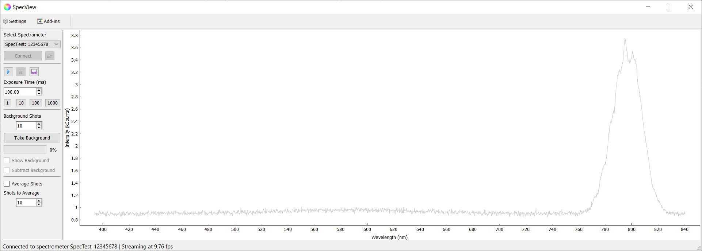

# specView

> GUI for operating Ocean Optics spectrometers.

[![License][license]][license-url]

A simple GUI to acquire, display, and save spectrum acquired from an Ocean Optics spectrometer. Includes background subtraction and averaging over several shots.



## Installation

Windows users are supplied self-contained builds of bint on the [latest releases](https://github.com/rariniello/specView/releases/latest) page.

## Usage example

Examples incoming...

_For more examples and usage, please refer to the [Wiki][wiki]._

## Development setup

Clone the repository

```sh
git clone <repo> 
```

Navigate into the repository's directory

```sh
cd specView
```

Create the virtual environment

```sh
conda env create -f requirements.yml
```

Activate the virtual environment

```sh
conda activate specView
```

Test that the application is starting properly

```sh
python specView.py
```

## Latest Version and Changelogs

The latest version along with release notes can always be found on the project's [releases](https://github.com/rariniello/specView/releases) page.

## Meta

Robert Ariniello

Distributed under the GNU GPL v3.0 license. See ``LICENSE`` for more information.

[https://github.com/rariniello/](https://github.com/rariniello/)

## Contributing

1. Fork it (<https://github.com/rariniello/specView/fork>)
2. Create your feature branch (`git checkout -b feature/fooBar`)
3. Commit your changes (`git commit -am 'Add some fooBar'`)
4. Push to the branch (`git push origin feature/fooBar`)
5. Create a new Pull Request

<!-- Markdown link & img dfn's -->
[license]: https://img.shields.io/github/license/rariniello/specView
[license-url]: https://github.com/rariniello/specView/LICENSE
[wiki]: https://github.com/rariniello/specView/wiki
